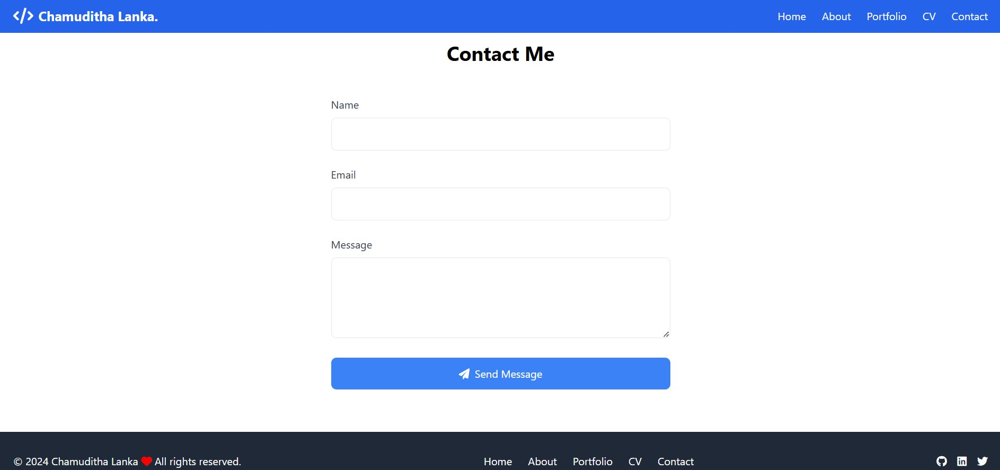

# Portfolio Website

A modern, responsive portfolio website built with HTML, CSS, JavaScript, and Firebase. Features a clean design, smooth animations, and real-time data management.


## 🌟 Features

- **Responsive Design**
  - Mobile-first approach
  - Seamless experience across all devices
  - Dynamic navigation menu

- **Project Showcase**
  - Web Development projects section
  - Graphic Design gallery with Fancybox integration
  - Real-time project updates via Firebase

- **Performance Optimized**
  - Lazy loading images
  - Optimized asset delivery
  - Smooth animations and transitions

- **Interactive Elements**
  - Contact form with FormSubmit integration
  - Social media links
  - Dynamic content loading

## 🛠️ Technologies Used

- HTML5
- CSS3 (Tailwind CSS)
- JavaScript (ES6+)
- Firebase Realtime Database
- Fancybox Gallery
- FormSubmit
- Font Awesome Icons

## 📱 Screenshots

<details>
<summary>Click to expand</summary>

### Home Page


### Projects Section


### Contact Form


</details>

## 🚀 Setup and Deployment

1. **Clone the repository**
   ```bash
   git clone https://github.com/chamudithalanka/portfolio.git
   ```

2. **Firebase Configuration**
   - Create a Firebase project
   - Add your Firebase config to `js/main.js`
   ```javascript
   const firebaseConfig = {
     // Your Firebase configuration
   };
   ```

3. **Deploy**
   - Deploy to GitHub Pages or your preferred hosting
   - Update FormSubmit email in contact form

## 📂 Project Structure

portfolio/
├── index.html
├── css/
│   └── styles.css
├── js/
│   └── main.js
├── images/
└── data/
    └── projects.json

## 🔧 Configuration

### Firebase Database Structure

{
  "projects": {
    "project1": {
      "title": "Project Title",
      "description": "Project Description",
      "technologies": ["Tech1", "Tech2"],
      "image": "image_url",
      "link": "project_link"
    }
  },
  "graphic_designs": {
    "design1": {
      "title": "Design Title",
      "category": "Category",
      "description": "Design Description",
      "imageUrl": "image_url"
    }
  }
}

## 🤝 Contributing

Contributions, issues, and feature requests are welcome! Feel free to check [issues page](link-to-issues).

## 📝 License

This project is [MIT](link-to-license) licensed.

## 👤 Contact

- Website: [chamudithalanka.github.io](https://chamudithalanka.github.io)
- GitHub: [@chamudithalanka](https://github.com/chamudithalanka)
- LinkedIn: [Chamuditha Lanka](https://lk.linkedin.com/in/chamuditha-lanka-)

## 🙏 Acknowledgments

- Tailwind CSS for the utility-first CSS framework
- Firebase for real-time database functionality
- Fancybox for the image gallery
- FormSubmit for the contact form handling
